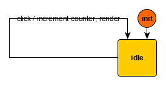

# Motivation
The `slim` package aims at supporting the creation of state machines with the [Kingly state machine library](https://brucou.github.io/documentation/). The Kingly state machine library may hover around a bundle size of 10-15KB. While Kingly is tree-shakeable and in practice the production size after tree-shaking is around 5KB (e.g. shaking away contracts, error management, and other development niceties), the `slim` compiler allows developers to reduce the footprint of their state machines. With real-life large machines (see below) compiling to ~2KB size, the gain may be large enough for the compilation step to be worthwhile. Additionally, the compiled code is standard, zero-dependency JavaScript that will work in older browsers (IE > 8).

With the [yed graph editor](https://www.yworks.com/products/yed-live), [devtool](https://github.com/brucou/yed2Kingly) and the present compiler, we believe the minimal set of pieces is in place for developing and maintaining comfortably large Kingly state machines.  

# Guiding principles
- the generated code should be readable by a human  
- the generated code should work in as many browsers as possible with a minimum of polyfills  
- the generated code should be easy to debug  
  
We thus decided to use `prettier`, include comments in the generated code, and avoid arrow functions and other newer JavaScript language features.

# How does it work?
In a typical process, I start designing a machine from the specifications by drawing it in the yEd editor. When I am done or ready to test the results of my design, I save the file. yEd by default saves its files in a `.graphml` format. I save the graphml file in the same directory in which I want to use the created state machine. From there, a previously launched watcher runs the `slim` node script on the newly saved file and generates the compiled JavaScript file which exports the machine factory -- you can of course also run the script manually instead of using a watcher. The provided exports can then be used as parameters to create a Kingly state machine.  

# Install
`npm install slim`

# Usage
```bash
slim file.graphml
```

Running the converter produces two files, targeted at consumption in a browser and node.js environment:

Before:
```bash
src/graphs/file.graphml
```

After:
```bash
src/graphs/file.graphml.fsm.compiled.js
src/graphs/file.graphml.fsm.compiled.cjs
```

The converter must emit an error or exit with an error code if the converted graph will not give rise to a valid Kingly machine (in particular cf. rules). The idea is to fail as early as possible.  
  
The produced file export one factory function which when runs with the right parameters will return a Kingly state machine.  
  
There are plenty of examples of use in the test directory. Let's illustrate the parameters received by the factory function:  

```js
    // require the js file
    const { createStateMachine } = require(`${graphMlFile}.fsm.compiled.cjs`);

    // Build the machine
    const guards = {
      'not(isNumber)': (s, e, stg) => typeof s.n !== 'number',
      isNumber: (s, e, stg) => typeof s.n === 'number',
    };
    const actionFactories = {
      logOther: (s, e, stg) => ({ outputs: [`logOther run on ${s.n}`], updates: {} }),
      logNumber: (s, e, stg) => ({ outputs: [`logNumber run on ${s.n}`], updates: {} }),
    };
    const fsm1 = createStateMachine({
      initialExtendedState: { n: 0 },
      actionFactories,
      guards,
      updateState,
    }, settings);
```

As can be seen from the example, the factory function's first parameter consists of four objects: the initial extended state of the machine; the JavaScript code for the action factories and guards referenced by name in the `.graphml` file;  and a reducer function `updateState` which takes an object and an array of modifications to perform on that object.  

Note that the compiled machine does not offer error messages, protection against malformed inputs, devtool or logging functionality. This is only possible when using the Kingly library.  

Note also that, as much as possible, we refrain from using advanced JavaScript language features in the code generated by the compiler with a view for that code to be usable in older browsers without polyfilling or babel-parsing. This however has not really been tested so far.  

## Browser compatibility
The compiled code should be working with older browsers, including IE > 9. This has not however been thoroughly tested. If you do encounter an issue with browser compatibility, do let us know by filing an issue in the GitHub repository.

## Rules
Some definitions:  
 - An initial transition is that which originates from a node whose label is `init` or any capitalized variations (such as `Init`, `INit`, `iniT`, etc.)
 - A top-level initial transition is that initial transition which does not have any parent node  
 - A history pseudo-state is a node whose label is `H` (shallow history) or `H*` (deep history) with this same capitalization  
 - A compound node is a node which is created in the yEd interface by using the group functionality (*Grouping > Group* or *Ctrl-Alt-G* in version 3.19).  

#### `slim` rules:
  - The compiler converts the `.graphml` file using the same algorithm than `yed2Kingly`. As such the same conversion rules that apply: the machine encoded in the `.graphml` file must correspond to a valid Kingly machine.
  - no control state, i.e. no node in the yEd graph can have an `init`-like label if that control state is not an initial transition.
  - the previous rule applies also for control states which are not pseudo-control states. They cannot be labelled a `H` or `H*`. Be careful that `h` will not be considered to be a pseudo control state, but a regular control state.
  - edge labels (which contain the event/guard/action triple under the following syntax `event [guard] / action (comment)`) are parsed with an [EBNF grammar](https://github.com/brucou/slim/blob/master/yedEdgeLabelGrammar.ne). As of June 2020, to avoid having to handle an ambiguous grammar:
    - `event` cannot have the characters `[`, `]`, `/`, `,` and `|` 
    - `guard` cannot have the characters `[`, `]`, and `,`
    - `actions` cannot have the characters `[`, `]`, `/`, `,` `(`, `)`, and `|`
  - edge labels can encode multiple transitions, provided those transitions encoding are separated by the `|` (pipe) character:
    - e.g. `| event1 [guard1] / action1 | event2 [guard2] / action2` encodes two transitions triggered respectively by `event1` and `event2`
  - edge labels also encode composite guards and composite actions. Composite guards and actions are comma-separated actions. `guard1, guard2` encodes a guard which will be satisfied only and only if both `guard1` and `guard2` are satisfied. Similarly, `action1, action2` encode two actions that will be composed to form a single action. The outputs of the composed is the concatenation of the outputs of each action, in the same order
    - e.g. `event [cond1, cond2] / action1, action2 (comment)`

The rules have been chosen for expressiveness, readability and multi-language support. Events, guards and actions can thus be described with several words if that is more descriptive. Unicode characters are accepted, meaning all languages supported by Unicode are supported by the compiler too. The few existing restrictions are for disambiguity: we do not want the compiler user to not write erroneous labels inadvertently.

# Size of file generated
There are plenty of graph examples in the [test directory](https://github.com/brucou/slim/tree/master/tests/graphs). 

Assuming the machine has no isolated states (i.e. states which are not reached by any transitions), the size of the compiled file follows the shape `a + b x Number of transitions`, i.e. is mostly proportional to the number of transitions of the graph. The proportional coefficient `b` seems to be fairly low and the compression factor increases with the size of the machine. In short, you need to write a really large graph to get to 5Kb just for the machine.

We give two data points. Minification is performed online with the [javascript-minifier](https://javascript-minifier.com/) tool. Liens of code are counted with an [online tool](https://codetabs.com/count-loc/count-loc-online.html). The simple counter machine, which is about the smallest non-trivial machine that can be drawn:



is compiled (as of Slim 0.9.0) to 50 lines of code, and has a minified compressed size of 500 bytes.

The password meter machine, a slightly more complex but still small example from the [documentation website](https://brucou.github.io/documentation/v1/tutorials/password-meter.html):   

![[password meter modelization]](https://brucou.github.io/documentation/graphs/password-meter.png)

is compiled (as of Slim 0.9.0) to zero-dependency 76 lines of code, with a minified compressed size of 600 bytes. 

The following complex wizard form was [implemented](https://github.com/brucou/cycle-state-machine-demo) with a machine having around 25 transitions: 


An implementation of the [Conduit average-sized application](https://rw-kingly-svelte.bricoi1.now.sh/#/) has ~35 states, ~75 transitions and weighted 2.3KB min.gzipped. We estimated that writing this logic by hand may have shaved 100 (extra code due to compiler) + 400 bytes (extra code due to using a graph editor), which is thus the cost we pay for using state machines and the graph editor (0.5KB).

Those preliminary results are fairly consistent. Assuming 20 bytes per transitions (computed from the previous data points), with a base line of 500 bytes, to reach 5KB (i.e. the size of the core Kingly library) we need a machine with 220 transitions!! Note that this size does not (and cannot) include the actions and guards but does represent the size of the logic encoded in the machine.

In summary, endowed with the present compiler, **Kingly introduces state machines essentially as a zero-cost abstraction**. This means that if you would have written that logic by hand, you would not have been able to achieve a significantly improved min.gzipped size.

# Tests
Tests are run with [mocha](https://mochajs.org/):

```bash
cd tests;
mocha end-to-end.specs.js 2> logError.txt > log.txt
``` 

# Known limitations
The `.graphml` format for yEd is not publicly documented. The parser for it thus may have holes or may break if the format specifications change, It is thus important that you log issues if you encounter any errors wile running the compiler. To be fair, the specifications have not changed in many years.

# Final note
After using and working with state machine for the past four years, I believe I am reaching a satisfying API and process. The idea is really to avoid unnecessary complexity. I am however interested in hearing your comments, and suggestions together with use cases that you believe are not satisfactorily addressed -> post an issue in the project directory.  
